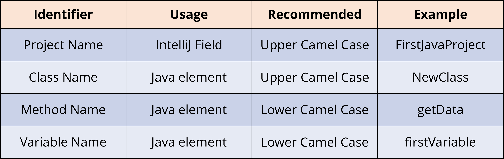

### Naming Items in Java

- Camel case is the practice of capitalizing the first letter of words in a name for readability, removing spaces or characters such as underscores between the words.
- Lower camel case only capitalizes the first letter of the second and subsequent words.
- Upper camel case, also known as Pascal case, capitalizes the first letter of the first word as well.
- 
- The **public** Java keyword is what's called an access modifier. An access modifier allows us to define which parts of our code, or even someone else's code, can access a particular element.
- The **class** keyword is used to define a class. Notice the left and right curly braces, they are used to define the class code block, or class body.
- A **method** is a collection of statements, one or more, that perform an operation.
- The **main method** - it's the entry point for any Java code, and Java looks for this main method to start and run the program.
- **The if-then statement** is the most basic of all the control flow statements.  It tells your program to execute a certain section of code, only if a particular test evaluates to true.**This is known as conditional logic.**
- Conditional logic uses specific statements in Java to allow us to check a condition, and execute certain code based on whether that condition (the expression) is true or false.
- **Conditional logic** uses specific statements in Java to allow us to check a condition, and execute certain code based on whether that condition (the expression) is **true** or **false**.
- **The assignment operator** assigns the value of an expression, to the variable to the left of the operator.
- **The equality operator** tests to see if two operands are considered equal, and returns a boolean value.
- The **and** operator comes in two flavours in Java, as does the or operator.

  - **&&** is the Logical and which operates on boolean operands – Checking if a given condition is true or false.
  - The **&** is a bitwise operator working at the bit level.  This is an advanced concept that we won't get into here.
- Likewise **||** is the Logical or, and again it operates on boolean operands – Checking if a given condition is true or false.

  - The **|** is a bitwise operator, which is also working at the bit level.
- **The ternary operator** has three operands.  The only operator currently in Java that does have three.  Officially, Java calls it the conditional operator.

  - operand1 ? operand2 : operand3
  - The ternary operator is a shortcut to assigning one of two values to a variable, depending on a given condition.
  - **So think of it as a shortcut of the if-then-else statement.**
