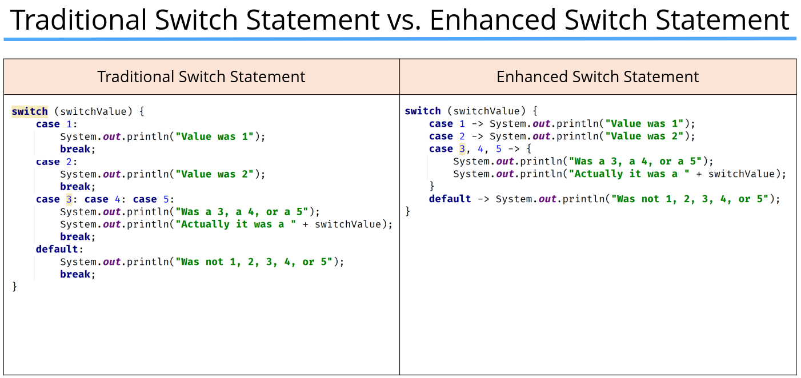
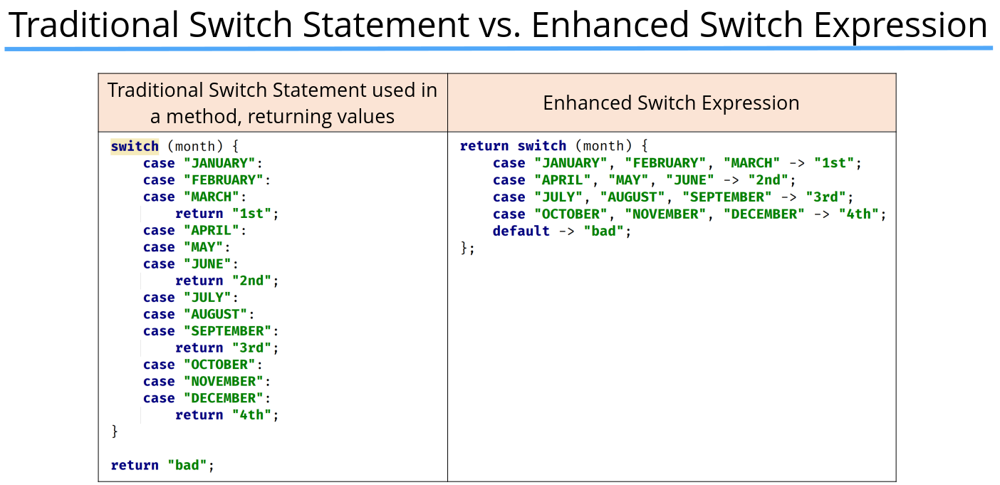

## Control Flow

### The switch statement

```java
switch(value){
    case x:
        // code for value == x
        break;
    case y:
        // code for value == y
        break;
    default:
        // code for value not equal to x or y
} 

```

- Important: Cannot use long, float, double or boolean or their wrappers in swithch  statement
- Once a switch case label matches the switch variable, no more cases are checked.
- Any code after the case label where there was a match found, will be executed, until a break statement, or the end of the switch statement occurs.
- Without a break statement, execution will continue to fall through any case labels declared below the matching one, and execute each case's code.
- 
- 
- When to use yield in a switch, Your switch statement is being used as a switch expression returning a value.

  ---
