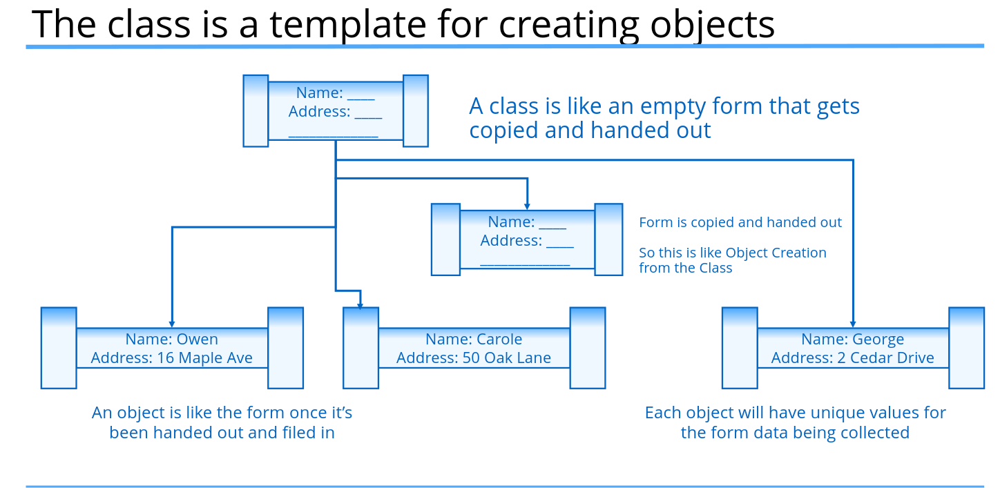

## Control Flow

### The switch statement

```java
switch(value){
    case x:
        // code for value == x
        break;
    case y:
        // code for value == y
        break;
    default:
        // code for value not equal to x or y
} 

```

- Important: Cannot use long, float, double or boolean or their wrappers in swithch  statement
- Once a switch case label matches the switch variable, no more cases are checked.
- Any code after the case label where there was a match found, will be executed, until a break statement, or the end of the switch statement occurs.
- Without a break statement, execution will continue to fall through any case labels declared below the matching one, and execute each case's code.
- 
- 
- When to use yield in a switch, Your switch statement is being used as a switch expression returning a value.

  ---

### The for statement

Java supports three statements for looping:
- **for** - The for loop is more complex to set up but is commonly used when you are iterating over a set of values.
- **while** - The while loop executes until a specified condition becomes false.
- **do while** - The do while loop always executes at least one and continues until a specified condition becomes false.

```java
for (init; expression; increment){
    // blok of statements
        }
```

These are declared in parentheses, after the for keyword, and are separated by semi-colons.

These parts are all optional and consist of the following:
- The initialization section declares or sets state, usually declaring and initializing a loop variable, before the loop begins processing. 
- The expression section, once it becomes false, will end the loop processing. 
- The increment section is executed after the expression is tested, and is generally the place where the loop variable is incremented. 

A break statement transfers control out of an enclosing statement.

### The while statement

```java
while (expression){
    // blok of statements
        }
        
do {
    // blok of statements
} while (expression);
```

### Local Variables and Scope

- **Local Variable** - A local variable is called local because it is available for use by the code block in which it was declared.  It is also available to code blocks that are contained by a declaring block.
- **Scope** - Scope describes the accessibility of a variable. "In scope" means the variable can be used by an executing block or any nested blocks. "Out of scope" means the variable is no longer available and cannot be used.

**Scope Best Practices**
- To declare and initialize variables in the same place, if possible.
- And to declare variables in the narrowest scope possible.

Local variables are a way to store and manipulate temporary data. In addition to local variables, we can set up data to be defined and used as part of a class or an object.

### The class, the object, static & instance fields and methods

**A class can be described as:**
- a custom data type.
- a special code block that contains methods.



**An object** is called an instance of a particular class.

The most common way to create an object is to use the **new keyword**. The new keyword creates an instance of a class, and you can optionally pass data when creating that instance to set up data on that object.

```java
String s = new String("Hello");
```


**static and instance fields**


**static and instance methods**


