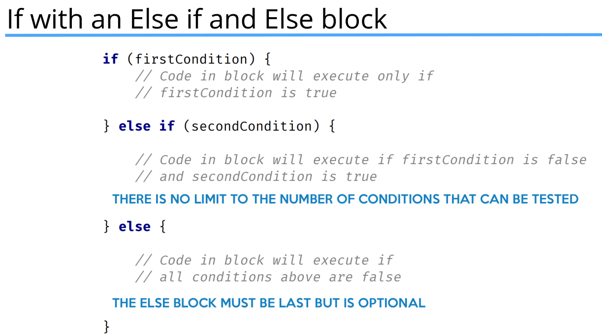

## Expressions, Statement and More

- **The Expression** – An expression computes to a single value.
- **The Statement** – Statements are stand alone units of work.
- **Code Blocks** – A code block is a set of zero, one, or more statements, usually grouped together in some way to achieve a single goal.
- 


### Methods

- A method declares executable code that can be invoked, passing a fixed number of values as arguments.
- A method is a way of reducing code duplication.  A method can be executed many times with potentially different results, by passing data to the method in the form of arguments.
- This method has a name, but takes no data in, and returns no data from the method (which is what the special word `void` means in this declaration).

```java
public static void methodName(){
    // Method statements form the method body 
}
```
- To execute a method, we can write a statement in code, which we say is calling, or invoking, the method. `methodName();`
-  Method parameters in the declaration.

```java
public static void methodName(p1type p1, p2type p2, {more}){
    // Method statements form the method body 
}
```
- **Parameters and arguments** are terms that are often used interchangeably by developers.But technically, a **parameter is the definition as shown in the method declaration**, and **the argument will be the value that's passed to the method when we call it**.
- To execute a method that's defined with parameters, you have to pass variables, values, or expressions that match the type, order and number of the parameters declared.
- 
- Java states that a return statement returns control to the invoker of a method. The most common usage of the return statement, is to return a value back from a method.
- In a method that doesn't return anything, in other words, a method declared with void as the return type, a return statement is not required.  It is assumed and execution is returned after the last line of code in the method is executed.
- But in methods that do return data, a return statement with a value is required.
- Some programming languages will call a **method that returns a value, a function**, and a **method that doesn't return a value, a procedure**.  
- A method is uniquely defined in a class by its name, and the number and type of parameters that are declared for it.  **This is called the method signature.**
  You can have multiple methods with the same method name, as long as the method signature (meaning the parameters declared) are different.
- In many languages, methods can be defined with default values, and you can omit passing values for these when calling the method.
  **But Java doesn't support default values for parameters.**
  **But it's important to state again, in Java, the number of arguments you pass, and their type, must match the parameters in the method declaration exactly.**
- 


